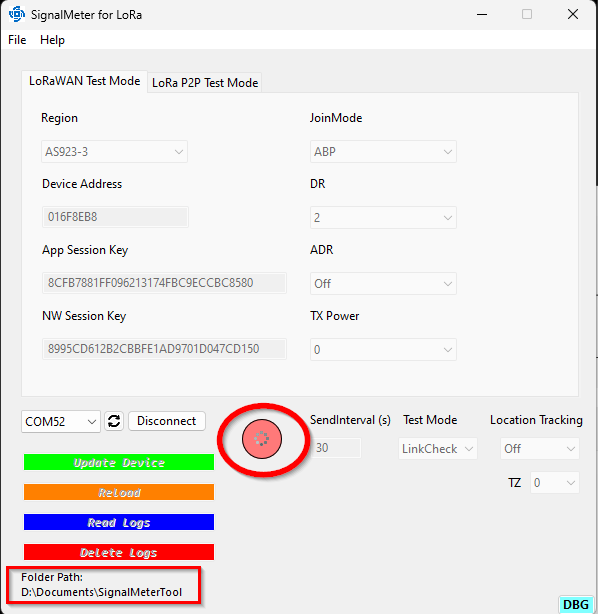

# Signal Meter Tool

As an alternative tool to setup the RAK10706 Signal Meter for LoRa, the SignalMeter Tool is available.     
It is a simple to use tool that provides to setup the different functions of the RAK10706 SignalMeter:
- Choose test mode
- Set the test interval
- Enable/Disable location tracking
- Set LoRaWAN region
- Get/set the LoRaWAN credentials (required to register the device in the LoRaWAN server)
- Set LoRaWAN Join mode, data rate, ADR, TX power
- Set LoRa P2P frequency, SF, BW, CR, preamble length and TX power
- If the device has RTC
   - get and adjust the RTC time and date
- If the device has a SD card
   - set the timezone for the log date/time
   - read the log files (can take very long time, it is recommended to take out the SD card and read the files on a computer instead)
   - delete all log files

### ⚠️ Communication errors
If the connection between the computer and the device is interrupted, it is necessary to restart both the tool and the device to ensure a proper restart.

----

## Installation

# ⚠️ These tools are not officially supported by RAKwireless and are provided as is.     

### Windows
For Windows an installer is available in the [SignalMeterTool-Windows](./SignalMeterTool/Windows) folder.

----

### macOS
For macOS (not fully tested), the application is in a zipped file in the [SignalMeterTool-macOS](./SignalMeterTool/macOS) folder.     
The app is not signed by Apple and you might need to run _**codesign.sh**_ once the application is installed.

----

### Linux
Only partly tested on Ubuntu. The application is in a zipped file in the [SignalMeterTool-Linux](./SignalMeterTool/Linux) folder.     
It was required to manually give access to the USB port with shell commands. 

----

## Start connection to the device

1) Connect the RAK10706 over Serial to the computer
2) Select the COM port to which the device is connected
   - If multiple USB devices are connected that provide a serial connection, it is recommended to remove the other devices.    
   - ⚠️ If the RAK10706 is connected to the computer _**after**_ the application was started, use the refresh icon to get the new port list.

   - If the port of the RAK10706 is known, select this port

   - If the device on the selected port is not a RAK10706, a warning will be displayed:

   - In this case change the port and retry to connect.

⚠️ Communication between the application and the device is indicated with a rotating BUSY icon. While the BUSY icon is visible, control items in the application are disabled (beside of _**Disconnect**_).    
Do not disconnect the device while the communication is ongoing, or the device setup might be incomplete.

3) Once the device connection is established, the UI of the SignalMeter Tool will change, depending on the available features and settings.

----

## User Interface overview

### The top part (1) of the display is showing the LoRa P2P or LoRaWAN settings. 
⚠️ The content is changing depending on the current device settings and can show 
- LoRaWAN settings for OTAA Join Mode
- LoRaWAN settings for ABP Join Mode
- LoRa P2P settings

### The bottom left part (2) is showing options to
- Send new settings to the device (Update Device)
- Reload current settings from the device (Reload)
- If a SD card is present
   - Read the test log files from the device and save them as .CSV files
   - Delete all log files from the device
   - The folder path where the log files are saved to.

### The middle left part (3) shows the device test settings
- Send interval for the test packets
- Test mode
   - LinkCheck for basic LoRaWAN test mode without an back-end server
   - LoRa P2P test mode
   - FieldTester modes (compatible only, does not provide all Field Tester functions, requires an backend setup)

### The bottom right part (4) is only shown if a RTC module is present
- Show current date and time on the device
- Set the timezone to have the correct time/date in the log files
- Computer current timezone and date time
- _**Set**_ button to synchronize the time on the device with the computer time

⚠️ The device time is the time at the connection to the device. It is not updated dynamically.

### Developer button
The small blue _**DBG**_ button on the bottom left side is opening an additional window that shows the communication between the device and the application:

----

## Setup for LoRaWAN OTAA Join Mode

⚠️ LoRaWAN OTAA Join Mode and LinkCheck test method are the factory settings.

This setup is only availble when the device is in _**LinkCheck**_ or _**Field Tester**_ test modes.    

⚠️ Important is to set the LoRaWAN region for the device to be able to communicate with gateways and LoRaWAN servers.    

The LoRaWAN DevEUI, AppEUI (JoinEUI) and AppKey are preset by RAKwireless with unique values during the production. There are two options:
- (Recommended) Use the preset EUI's and Key to register the device on a LoRaWAN server (Chirpstack, TTN, Actility, ....) 
- Get EUI's and Key from the the LoRaWAN server and change the values here.

In addition, the TX power for the uplinks and datarate for the uplinks can be set here and adaptive datarate can be enabled or disabled.

⚠️ Changing the Join Mode will change the display content!

----

## Setup for LoRaWAN ABP Join Mode

This setup is only availble when the device is in _**LinkCheck**_ or _**Field Tester**_ test modes.    

⚠️ Important is to set the LoRaWAN region for the device to be able to communicate with gateways and LoRaWAN servers.    

The LoRaWAN Device Address, Nw Session Key and App Session key must be set the same on the LoRaWAN server and in the device. Retrieve the keys and device address from your LoRaWAN server and use them here to setup the device with the correct values.

In addition, the TX power for the uplinks and datarate for the uplinks can be set here and adaptive datarate can be enabled or disabled.

⚠️ Changing the Join Mode will change the display content!

----

## Setup for LoRa P2P Mode

⚠️ Important in LoRa P2P test mode is that other devices are setup to the same settings, otherwise they cannot communicate with each other.    

Set the transmission parameters like frequency, bandwidth, coding rate, spreading factor, preamble length to the same values used by other LoRa P2P device that are used in the coverage testing.

----

## Setup Send Interval, Test Mode and Location Tracking

These settings define the test interval, the test mode and whether location tracking is used or not.

Send interval defines how many seconds are between two outgoing test uplinks.    

Test Mode switches between the different available test modes.    

⚠️ Changing the test mode does not immediately enforce a change. It is required to use the _**Update Button**_ to send the new setting to the device first. The device will reset once it received the update and the application will reconnect automatically.

Location tracking enables or disables the GNSS location chip in the device.

⚠️ When to enable or disable the GNSS location tracking:    
Location tracking works only outdoors. If the test is for coverage test indoors, the GNSS location tracking should be disabled. This will reduce power consumption of the device.    

----

## Send setting to the device

Once the setup is finished, the device must be synced to the new settings with the _**Update Device**_ button.    
Pushing the button, will send all new settings to the device. The device will reset once it received the update and the application will reconnect automatically.     
While the settings are send to the device, the ongoing documentation is indicated with a rotating BUSY icon and the application UI is disabled.    

After the update is finished, the application UI will refresh with the new settings.    

----

## Setting the timezone

⚠️ These function is only available if the device is equipped with an SD Card module.    

If the device does not have an RTC module, it will retrieve the date and time from the LoRaWAN server with the TimeRequest command. The date and time sent by the LoRaWAN server is in GMT+0 format. To get the correct date and time in the log files, the device has to be setup with the correct timezone.

----

## Reading and erasing log files

⚠️ These functions are only available if the device is equipped with an SD Card module.    

### Reading the log files

With the _**Reading Logs**_ button, the log files saved on the SD card of the device can be read.    
The log files will be saved in .CSV (comma separated values) format. This format can be imported by most spread sheet applications like Excel.    
The RAK10706 Signal Meter splits the log into several small files to avoid file corruption during the tests. The files need to be joined together manually in the spread sheet application.    

During the download of the files, the rotating BUSY icon is shown.    
The path where the files are saved are shown below the buttons.

# ⚠️
_**Retrieving the log data over the USB port can take a long time, depending on the number and size of the log files.**_    
_**It is recommended to remove the SD card from the device and use a computer and a SD Card adapter to copy the log files. This method is much faster than reading out the files from the device**_
# ⚠️

After all log files are downloaded, the RAK10706 SignalTester will perform a reset and the application will automatically reconnect to it.

⚠️ If the log output is enabled with the blue _**DBG**_ button, the progress of the download can be seen in the application.    

----

### Erase the log files

The _**Delete Logs**_ button will erase all stored log files from the SD card of the RAK10706 SignalMeter.    

Before the data is erased, a confirmation window will be shown.    

----

## Setting the time and date

⚠️ These functions are only available if the device is equipped with an RTC module.    

The current date and time of the RTC and the used timezone are displayed in the application.    
As reference, the current computer date, time and timezone are shown below.    
The date and time can be changed manually or synced with the computer time using the _**Set**_ button.    
The device date and time will be updated by using the _**Update Device**_ button.    

----
----
----
# LoRa® is a registered trademark or service mark of Semtech Corporation or its affiliates.

# LoRaWAN® is a licensed mark.

----
----
----