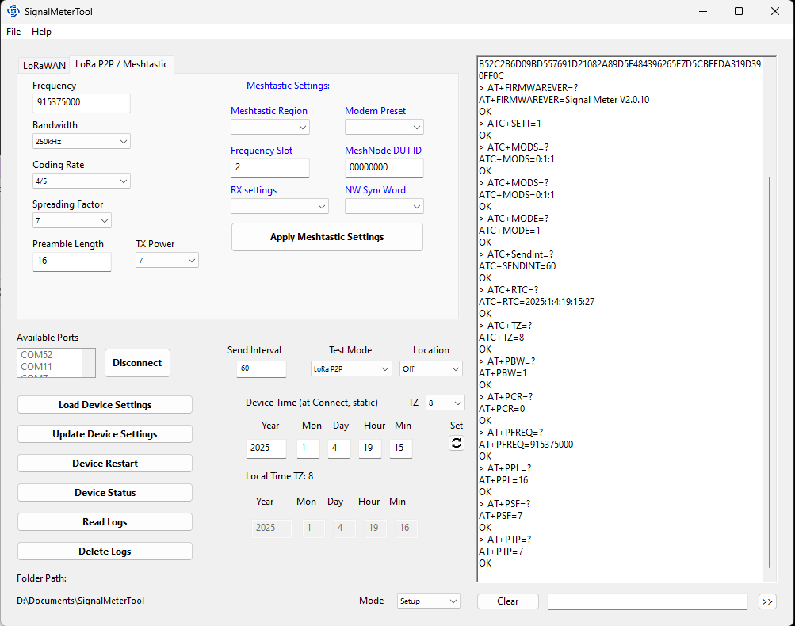
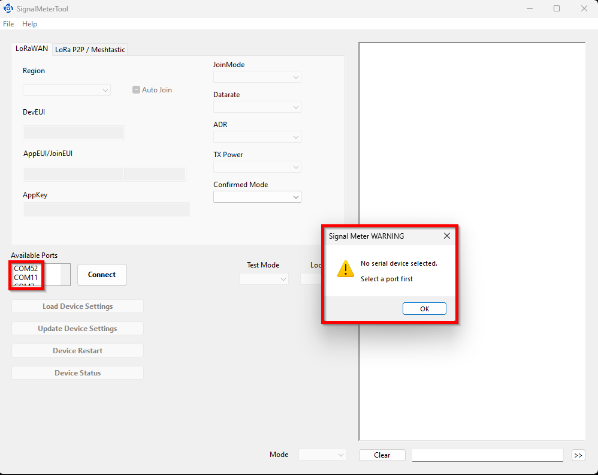
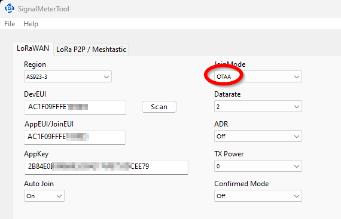
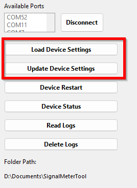
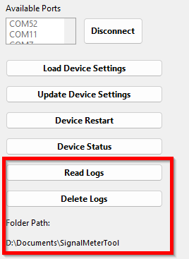

# Signal Meter Tool
|  |      |  |    
| :-: | :-: | :-: |

Signal Meter Tool is an application to setup a RAK10706 without the hassle of sending AT commands from a Serial Terminal Application.    
#### ⚠️ IMPORTANT ⚠️
#### _**This is not an official RAKwireless application!**_      
It was written in my free time and has no official support from RAKwireless.    
It is not fully tested and still has bugs.     
It is tested on Windows 11, on a Linux Ubuntu 24.04 based VM (automatic reconnection doesn't work in the VM) and should work macOS ????????? (not tested by me).

# Installation 

## Windows
For Windows 11 an application installer is in the [SignalMeterTool/Windows](./Windows/) folder.     
Virus scanner will most likely complain about it, as it is not a signed Windows application.

## Linux
For Ubuntu 24.04 download the content of the [SignalMeterTool/Linux](./Linux) folder.     

#### ⚠️ IMPORTANT ⚠️
It might be required to add your user to the _**`dialout`**_ group to get access to the USB ports of the Linux Machine.    
Another requirement might be to give the user access to the folder where the application was saved.
```shell
sudo usermod -a -G dialout $USER

sudo chown -R $USER ./SignalMeterTool
```

## macOS
For macOS download the content of the [SignalMeterTool/Linux](./macOS) folder.     

#### ⚠️ IMPORTANT ⚠️
I have no machine with macOS and could not test the installation procedure or the application itself

----

# Usage
After installation, start the application. The UI is separated into 5 parts.    
1. Serial Ports, Connect/Disconnect button, Update Device and Reload Device
2. LoRa P2P and LoRaWAN settings
3. Test mode settings
4. Buttons to read or delete log files _**(only available if the device is equipped with an SD card)**_
5. Functions to setup the RTC and the timezone _**(only available if the device is equipped with a RTC module)**_

<center></center>

## Connect to the device

Check the available devices in the **Available Ports** list box. To find the correct port where the RAK10706 is connected, start the application first, then plug in the device into the USB port.    
The list box will be automatically updated with the new device, which will be the RAK10706.     

<center></center>

Once you have selected the port, push **Connect** to establish a connection to the device.     
While connecting, the application will read the current settings from the RAk10706. This can take a while and you will see a red **Busy** wheel next to the **Connect** button.     

#### ⚠️ Potential errors during connection ⚠️
1. No port or an invalid port was selected
<center></center>     

In this case, select a port from the list box.     

2. Device is not a RAK10706 device
<center></center>     

This application does only work with the RAK10706 Signal Meter for LoRa!

3. A communication error occured    
<center></center>     

The device does not support RUI3 AT commands or a communication error occured during fetching the device settings. In this case, disconnect the device and restart the application. Make sure the device you are connecting to is a RAK10706 Signal Meter for LoRa.

----

## Application UI after successful connection

After a successful sync with the device, the UI will change, depending on the current settings of the device and the available modules.     

### LoRaWAN test modes
If the device is in a test mode that is using LoRaWAN (LinkCheck or Field Tester modes), the UI will show the LoRaWAN credentials and LoRaWAN settings.    
Independent of the Join Mode, the following settings can be set:

1. Region → Select the LoRaWAN region that device will be used with.
2. DR → Set the data rate that will be used for the testing.
3. TX Power → Set the TX Power that will be used for the testing.
4. ADR → Enable or disable the automatic data rate adaption.     
⚠️ _**During testing, it is recommended to disable ADR to get usable test results**_
5. JoinMode → Change the join mode between OTAA and ABP. _**The change will only be applied after the device settings are updated and the device rebooted!**_
6. Automatic Network Join → The device will automatically join the network after power-up.    
⚠️ _**It is essential to enable the automatic network join on the Signal Meter before using it**_

Depending on the LoRaWAN Join mode, the device credentials will be different:

----

#### LoRaWAN in join mode OTAA

In OTAA mode, the UI will show the DevEUI, AppEUI (JoinEUI) and the AppKey:

<center></center>     

The credentials can be copied from the application and used to register the device in a LoRaWAN server. Or, if preferred, the credentials can be set to values that are provided by a LoRaWAN server.    

----

#### LoRaWAN in join mode ABP

In ABP mode, the UI will show the DevEUI, AppEUI (JoinEUI) and the AppKey:

<center></center>     

The credentials can be copied from the application and used to register the device in a LoRaWAN server. Or, if preferred, the credentials can be set to values that are provided by a LoRaWAN server.    

----

### LoRa P2P test mode
If the device is in LoRa P2P test mode, the UI will show the P2P (Phy) settings. These settings must be identical to the LoRa P2P network that other LoRa nodes in the test are using:

<center></center>     

#### ⚠️ Information
The device setup supports only LoRa mode, it is not possible to setup the device to FSK mode. If this is required, it has to be done with AT commands.     

----

### Send Interval, Test Mode and Location

This section of the UI allows to change the send interval, select the test mode and enable or disable the location tracking mode.    

<center></center> 

----

#### Send Interval
The send interval defines the time between sending test packets. The value is set in seconds. _**Values below 10 seconds are not recommended for test modes that are using LoRaWAN. If set too short, the downlink packets from the LoRaWAN server might not be received.

----

#### Test Mode selection
Four different test modes are available on the RAK10706 Signal Meter. Three of them are working in LoRaWAN mode, one is for LoRa P2P.    
For differences between the test modes, check the [RAK10706 Quick Start Guide's](https://docs.rakwireless.com/product-categories/wisnode/rak10706/quickstart) _**https://docs.rakwireless.com/product-categories/wisnode/rak10706/quickstart#difference-between-the-rak10706-signal-meter-and-the-rak10701-field-tester**_ section.

#### ⚠️ Important
Changing the test mode, will immediately reboot the device and set it to the new selected test mode.

### Update Device and Reload

<center></center> 

#### Update Device

Once device settings are changed, the changes can be synced to the Signal Meter using the _**Update Device**_ button.

#### ⚠️ Important
After sending the new settings, the device will be rebooting!

#### Reload

In case some settings are changed by mistake, the original settings can be reloaded from the device by using the _**Reload**_ button.

#### ⚠️ Important
Reloading the settings will only recover the original settings of the device _**BEFORE**_ the settings were synced with the device! Once the _**Update Device**_ button was used, the original settings cannot be recovered.

----

#### Location
Depending on the test scenario (indoor or outdoor) it is possible to enable or disable the location module of the Signal Meter. 
An overview of different test scenarios are in the [RAK10706 Quick Start Guide's](https://docs.rakwireless.com/product-categories/wisnode/rak10706/quickstart#typical-test-scenarios) _**Typical Test Scenarios**_ section.

#### ⚠️ Important
Testing with the location tracking disabled does increase the life-time of the battery and is recommended if not absolute required.

### Reading and Deleting Log Files

#### ⚠️ Important
These functions are only enabled if the RAK10706 SignalMeter is equipped with an SD card.

<center></center> 

----

#### Reading Logs

#### ⚠️ Important
_**Downloading the log files over the USB connection can take a very long time, depending on the size and number of log files stored on the SD card. It is recommended to remove the SD card from the device instead and copy the log files directly on a computer**_

Using the _**Read Logs**_ button will start the transfer of all log files from the SD card to the computer over the USB connection.     
The log files are in .CSV (comma separated values) format and can be read for further processing from most spreadsheet applications.    
The log files are saved in the folder shown below the button in the _**Folder Path:**_ section. Each reading of the log files will create a new sub folder in this path with the date and time the readings are started.

Log files top folder:

<center></center>     

Log files:

<center></center>     

#### ⚠️ Important
After reading the log files is finished, the device will be rebooting!

----

#### Delete Logs

Using the _**Delete Logs**_ button will erase all saved log files from the SD card. After using this button, the log files can not be recovered any more.

#### ⚠️ Important
After deleting the log files is finished, the device will be rebooting!

----

### Setting the RTC and the Time Zone

<center></center> 

----

#### Setting the Time Zone

The device will synchronize its internal time with the LoRaWAN server time it is connected to. However the LoRaWAN server is sending the time in GMT+0 format. The device time is used in the log files, therefor it is important to set the correct Time Zone in which the device is used. Otherwise the date and time entries in the log files will be in GMT+0 format.

#### ⚠️ Important
_**It is essential to set the time zone the device will be used in to have the correct date and time in the log files**_

----

#### Setting the RTC module

#### ⚠️ Important
This function is only enabled if the RAK10706 SignalMeter is equipped with an RTC module.

The RTC module in the RAK10706 Signal Meter has a small back-up battery that can ensure that the time is kept accurate if the device is switched of for 1-2 weeks. But if the Signal Meter is not used over a longer time, the RTC will loose its time. The _**Set**_ button allows to synchronize the RTC time with the time of the connected computer.

----

### About the Application
This application was designed using [Xojo](https://xojo.com/), a cross-platform App Development Platform.
the project for this application can be found in the [SignalMeterTool/Project](./Project) folder.

This application is licensed under MIT.

<center></center> 

----
----

# LoRa® is a registered trademark or service mark of Semtech Corporation or its affiliates. 


# LoRaWAN® is a licensed mark.

----
----
